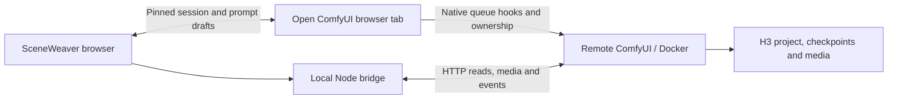

# Companion architecture

The active ComfyUI tab owns the live graph. H3 Context Loop owns the project catalog, ownership, generation, continuity, review gates, checkpoint lineage, and assembly. SceneWeaver provides an attached editing and inspection workspace. Standalone production is deferred until that companion workflow is dependable.

## Live attachment

The user launches the companion from the intended ComfyUI page. A bookmarklet works without installing server code; an optional ComfyUI browser extension supplies a persistent button. Both load the public `companion-client.mjs` adapter and synchronously open a child window before asynchronous module loading.

Messages require the exact source window, configured origin, protocol identifier, and random per-launch session token. The token travels in the fragment, not an HTTP query or server store. Only public integration modules are readable cross-origin from the configured ComfyUI origin; local API routes retain their host/origin checks.

Snapshots bind the active workflow identity to its graph object, with a content revision over named scalar widgets and links. Layout and selection changes do not invalidate drafts. Private ownership, operation, and credential widgets are excluded. Nested nodes have inspection paths rather than guessed executable IDs.

SceneWeaver holds a baseline and a draft. Three-way reconciliation preserves disjoint widget edits and flags shared-widget conflicts. Apply validates the binding, revision, editability, and original value of every changed widget before any assignment. It calls native widget callbacks and graph change hooks. Widget values roll back on synchronous callback failure; external effects inside third-party callbacks are outside that rollback. Changing tabs stops writes until the user returns or explicitly attaches the new tab.

Queueing calls ComfyUI's native `app.queuePrompt`, preserving its serialization and hooks. Live inspection documents cannot be queued as reconstructed API graphs. Export serializes the native root graph.

## Native project integration

Project identity is derived from the selected Plan and its directly connected Asset Carousel. Asset changes are explicit parent-tab commands. The adapter imports the ownership and catalog-sync helpers with the exact versioned module URLs used by the installed H3 carousel, so it shares the existing owner controller. It performs normal ownership checks, never force ownership.

Asset updates verify original displayed fields before submitting. Uploads put project/role/tag fields before the multipart file, as required by H3. Imports use ComfyUI input-relative paths. Completed catalogs update the original node widget and publish the native synchronization event. A changed tab, manager, or project prevents delayed responses from updating the new graph. Backend ownership and mutation validation remain H3's responsibility; the upstream asset API does not currently expose an atomic compare-and-swap revision condition.

Checkpoints are read from H3's graph-enabled endpoint. SceneWeaver shows revisions, active takes, delivered length, prompt, seed, and dependencies, and exports media or metadata. Activation, deletion, dependency repair, and branch changes remain native until a versioned adapter and representative production trials cover their effects.

## Main modules

- `public/integrations/bridge-core.mjs`: widget validation, draft diffing, and reconciliation shared by the browser adapter and UI.
- `public/integrations/companion-client.mjs`: native graph adapter, message session, queue hooks, H3 ownership delegation, and execution forwarding.
- [ComfyUI-SceneWeaver-Companion](https://github.com/ethanfel/ComfyUI-SceneWeaver-Companion): separately maintained Python registration stub and browser launch button. It loads the live bridge from the running SceneWeaver app, keeping the bridge protocol matched to the UI.
- `src/hooks/useLiveWorkflow.ts`: verified parent messages, request acknowledgments/timeouts, and connection state.
- `src/hooks/useComfy.ts`: remote discovery, job reconciliation, reviews, checkpoints, history, and scoped queue controls.
- `src/components/ProjectPanel.tsx`: project asset edits and take inspection, with stale-response cancellation.
- `src/components/Inspector.tsx`, `Timeline.tsx`, `ReviewPanel.tsx`: scene settings, generation sequence, and H3 review actions.
- `src/lib/workflow.ts`: detached imports/exports, supported canvas conversion, validation, and exact integer reading.
- `server/app.mjs`: loopback HTTP/WebSocket proxy and public integration asset delivery.

## Next: validate the assistant on production workflows

Attach representative existing H3 projects with unsaved changes, nested graphs, Get/Set routing, active review gates, and long-running renders. Verify native Plan/Carousel synchronization, prompt edits, queue serialization, reconnect behavior, media playback, and server-side ownership refusal against the installed H3 version.

Then add reference-slot assignment and folder management, explicit checkpoint/branch operations with dependency previews, accurate upstream presentation timing, source-audio alignment, and final-assembly controls. Capability detection must hide unsupported mutations rather than invent protocol compatibility. Native ComfyUI remains an accessible route for every advanced operation.

## Later: standalone editor

Only after the companion is sturdy, add a durable project service and a separate edit document containing tracks, clip instances, source in/out points, and absolute start frames. Media assets reference immutable H3 revisions or imported files; trims and splits must not rewrite source checkpoints or scene IDs.

A later export service can render an immutable edit snapshot with FFmpeg where source files are accessible. Proxy generation, waveforms, transitions, color, subtitles, and standalone orchestration follow that foundation. GPU generation continues to use ComfyUI/H3.
