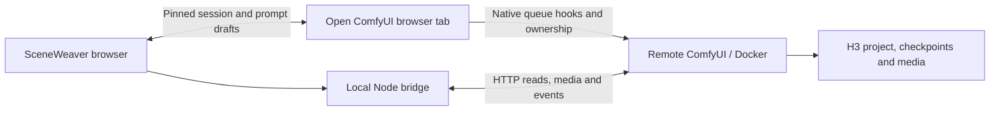

# Companion architecture

The active ComfyUI tab owns the live graph. H3 Context Loop owns the project catalog, ownership, generation, continuity, review gates, checkpoint lineage, and assembly. SceneWeaver provides an attached editing and inspection workspace. Standalone production is deferred until that companion workflow is dependable.

## Live attachment

The user launches the companion from the intended ComfyUI page. A bookmarklet works without installing server code; an optional ComfyUI browser extension supplies a persistent button. Both load the public `companion-client.mjs` adapter and synchronously open a child window before asynchronous module loading.

Messages require the exact source window, configured origin, protocol identifier, and random per-launch session token. The token travels in the fragment, not an HTTP query or server store. Only public integration modules are readable cross-origin from the configured ComfyUI origin; local API routes retain their host/origin checks.

Snapshots bind the active workflow identity to its graph object, with a content revision over named scalar widgets and links. Layout and selection changes do not invalidate drafts. Private ownership, operation, and credential widgets are excluded. Nested nodes have inspection paths rather than guessed executable IDs.

SceneWeaver holds a baseline and a draft. Three-way reconciliation preserves disjoint widget edits and flags shared-widget conflicts. Apply validates the binding, revision, editability, and original value of every changed widget before any assignment. It calls native widget callbacks and graph change hooks. Widget values roll back on synchronous callback failure; external effects inside third-party callbacks are outside that rollback. Changing tabs stops writes until the user returns or explicitly attaches the new tab.

Queueing calls ComfyUI's native `app.queuePrompt`, preserving its serialization and hooks. Live inspection documents cannot be queued as reconstructed API graphs. Export serializes the native root graph.

## Native project integration

Project identity is derived from the selected Plan and its directly connected Asset Carousel. Asset changes are explicit parent-tab commands. The adapter imports the ownership and catalog-sync helpers with the exact versioned module URLs used by the installed H3 carousel, so it shares the existing owner controller. It performs normal ownership checks, never force ownership.

Asset updates verify original displayed fields before submitting. Uploads put project/role/tag fields before the multipart file, as required by H3. Imports use ComfyUI input-relative paths. Completed catalogs update the original node widget and publish the native synchronization event. A changed tab, manager, or project prevents delayed responses from updating the new graph. Backend ownership and mutation validation remain H3's responsibility; the upstream asset API does not currently expose an atomic compare-and-swap revision condition.

Checkpoints are read from H3's graph-enabled endpoint. Takes can be compared with thumbnails, separate audio, prompts, exact seeds and durations. Final-cut selection accepts only the current base or a ready picture alternate belonging to that base. It reads fresh metadata, checks the displayed editorial revision, preserves the complete editorial document, and submits H3's `base_revision` precondition through native ownership. Native Plan Studio and checkpoint views are refreshed after success.

Checkpoint activation is a two-step parent-tab command. The installed versioned H3 helpers determine lineage/eligibility and validate restoration into the attached Plan. A single-use ticket binds the displayed chapter impact to the workflow, Plan, manager, project, and serialized graph/editorial evidence retained only in the parent adapter. This works on plain HTTP ComfyUI hosts without requiring Web Crypto. Confirmation rereads the evidence and requires an empty ComfyUI queue before sending H3's scoped `activate_only` request. Later active pointers within the chapter are retired; immutable records remain. Native helpers restore the returned scene settings and refresh prompt editors. A tab, project, or Plan edit during the request prevents a late response from overwriting newer graph state and reports the partial outcome. Loop resume settings, model/policy wiring, deletion and lineage attribution remain native controls.

H3 revalidates its checkpoint graph inside its write transaction. Its current activation endpoint does not accept the companion's preview evidence as an atomic server precondition; another client can still change state in the interval after the companion's final read. Editorial writes do have a server-enforced revision precondition. The adapter was checked read-only against installed native checkpoint helpers and 24 eligible saved lineages; mutation/browser tests use synthetic fixtures.

## Draft recovery

Only editable widget deltas are saved under a browser-local key containing the server, stable workflow path/graph identity, selected Plan, and baseline project. Credentials, ownership widgets, catalogs, attachment tokens, and the rest of the live graph are excluded. A matching attachment offers recovery before writes; current and saved values can be reviewed, including remote changes since the original baseline. Restore builds a draft on the current live snapshot, while native Apply still validates its revision. Unavailable or repurposed widgets block restoration and leave export available. Apply/discard clears the backup; a concurrent browser window's differing backup is preserved and reported. Storage failures retain the in-memory draft and leave warning.

## Presentation playback

Checkpoint reads retain H3's editorial record, audio sidecars, picture alternates, and selected presentation video. The viewer prefers the saved final-cut picture, pairs silent pictures with the appropriate base WAV, and avoids doubling sound already muxed into review previews. Archived picture alternates resolve audio from their base revision.

Timeline strips and scene-bin cards load H3’s cached `plan-studio/checkpoint-thumbnail` JPEG for the saved revision, preferring the selected alternate when present. H3 supplies an early clip poster; wider timeline clips repeat that same poster, rather than sampling additional positions. Images load lazily and fall back to the scene placeholder on failure. Revision changes remount failed images, and a server-specific query parameter keeps the proxy’s immutable browser cache entries separate across remote ComfyUI targets. No browser video decoders or new thumbnail service are required.

The saved Plan Studio presentation supplies a source-audio token and seek offset; project audio assets supply timed lyrics selected by the editorial subtitle settings. Audio and captions use the scene's editorial start after saved trims and placements. Viewer switches change monitoring only. They do not write source audio settings, subtitle settings, or take choices back to H3; take selection is a separate explicit action in Takes.

Sequence playback follows the sorted editorial segments and retains gaps as timeline time. Rendered footage drives the clock from the current video; gaps, unrendered scenes, and a short video's remaining planned duration use an animation clock. The source audio element survives scene changes; departing picture and generated-audio elements are paused. Buffering freezes the picture clock and pauses accompanying audio. The global scrubber and timeline playhead share the same sequence position, including in gaps.

Manual scene navigation pauses playback. Take previews are isolated in Clip mode; returning to Sequence restores the saved final-cut choices. Changing the saved cut pauses an active sequence for review. Playback stops at the last planned scene, and replay starts at zero. This browser transport does not assemble media or promise frame-exact, gapless delivery between remote files.

## Generation monitoring

The optional PreviewRelay adapter uses `preview_relay` notifications on the existing ComfyUI WebSocket, plus GET `/preview_relay/state` and `/preview_relay/media` with an exact channel name. These broadcasts have no prompt or node identity, so they bypass job-ID filtering but never update job status or scene media. Channels are discovered from the attached baseline's literal relay/target inputs; linked channel values require explicit selection.

Opening Generation restores sampling statistics and the latest media. A single transfer loop coalesces new sequence notifications instead of accumulating image downloads. Responses are fenced by channel, connection, and sampling reset; abort signals cancel stale work. A fresh reset clears the image and suppresses restoration of the previous media still cached upstream until the new run has a sample. Blob URLs are released on replacement and cleanup. Unsupported MIME types and invalid media data fail visibly. Reconnects reread state, and a changed native workflow tab pauses the monitor until the attachment is resolved.

The adapter supports JPEG, PNG, animated WebP, and MP4/WebM samples with optional WAV audio. Audio is opt-in and follows the sample video clock when available. Animated image playback has no readable browser clock, so its audio loops independently. The native PreviewRelay page remains available for decoding controls; SceneWeaver does not write to its channel-global control endpoint.

Protocol inspected at PreviewRelay revision `460878239193fd4dc943d9130db8dc1748228bbb`. Browser tests use synthetic media and mocked endpoints. An actual H3 generation with the installed relay remains a production compatibility check, not a result of those tests.

## Main modules

- `public/integrations/bridge-core.mjs`: widget validation, draft diffing, and reconciliation shared by the browser adapter and UI.
- `public/integrations/companion-client.mjs`: native graph adapter, message session, queue hooks, H3 ownership delegation, and execution forwarding.
- [ComfyUI-SceneWeaver-Companion](https://github.com/ethanfel/ComfyUI-SceneWeaver-Companion): separately maintained Python registration stub and browser launch button. It loads the live bridge from the running SceneWeaver app, keeping the bridge protocol matched to the UI.
- `src/hooks/useLiveWorkflow.ts`: verified parent messages, request acknowledgments/timeouts, and connection state.
- `src/hooks/useComfy.ts`: remote discovery, job reconciliation, reviews, checkpoints, history, and scoped queue controls.
- `src/lib/playback.ts`: media selection, subtitle parsing, and editorial timing. `PreviewPlayer.tsx` synchronizes picture, generated audio, source soundtrack, and captions.
- `src/lib/previewRelay.ts`, `src/hooks/usePreviewRelay.ts`, `src/components/GenerationPanel.tsx`: optional channel-based sampling previews and audio, with bounded media replacement and connection cleanup.
- `src/components/ProjectPanel.tsx`: project asset edits. `TakesPanel.tsx` compares saved takes and previews checkpoint impact. Both cancel stale reads.
- `public/integrations/takes-core.mjs`: final-cut validation and native checkpoint impact; `src/lib/drafts.ts` and `useDraftRecovery.ts`: scoped widget-draft persistence and recovery.
- `src/components/Inspector.tsx`, `Timeline.tsx`, `ReviewPanel.tsx`: scene settings, generation sequence, and H3 review actions.
- `src/lib/workflow.ts`: detached imports/exports, supported canvas conversion, validation, and exact integer reading.
- `server/app.mjs`: loopback HTTP/WebSocket proxy and public integration asset delivery.

## Next: validate the assistant on production workflows

Attach representative existing H3 projects with unsaved changes, nested graphs, Get/Set routing, active review gates, and long-running renders. Verify native Plan/Carousel synchronization, prompt edits, queue serialization, reconnect behavior, media playback, and server-side ownership refusal against the installed H3 version.

Then add reference-slot assignment and folder management, lineage attribution, workflow-local branch selection, and final-assembly controls. Capability detection must hide unsupported mutations rather than invent protocol compatibility. Native ComfyUI remains an accessible route for every advanced operation.

## Later: standalone editor

Only after the companion is sturdy, add a durable project service and a separate edit document containing tracks, clip instances, source in/out points, and absolute start frames. Media assets reference immutable H3 revisions or imported files; trims and splits must not rewrite source checkpoints or scene IDs.

A later export service can render an immutable edit snapshot with FFmpeg where source files are accessible. Proxy generation, waveforms, transitions, color, subtitles, and standalone orchestration follow that foundation. GPU generation continues to use ComfyUI/H3.
