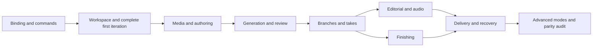

# SceneWeaver: complete H3 workflow control

**Planning draft · 10 September 2026 · implementation starts from SceneWeaver 0.4.0**

The target is to operate a supported H3 production from SceneWeaver: open its workflow and project, organize references, author scenes, generate and review, explore versions, resume, finish, and deliver. ComfyUI and H3 remain the execution and storage authorities. SceneWeaver becomes the complete creative control surface.

“Full parity” means an operation is understandable, configurable, executable, observable, and recoverable inside SceneWeaver. A native-node shortcut or generic scalar input is useful during development but does not count as completion for a supported production task. Internal execution nodes do not each need a separate panel; their behavior belongs in the task that uses them.

This plan covers the current H3 feature set, including legacy compatibility and explicitly experimental modes. It does not promise every feature of DaVinci Resolve or bespoke interfaces for every possible third-party ComfyUI pack. Existing third-party nodes get preserved graph wiring and a schema-based inspector; packs required by the maintained H3 recipes get named adapters. The exact production graph must be audited before claiming its complete coverage.

## 1. Baseline and evidence

- SceneWeaver: `68ba383`, version 0.4.0.
- H3 nightly inventory refreshed: [`326453d71065f8031c160ea4d504678dab3e0cc1`](https://github.com/ethanfel/ComfyUI-MiniMaxH3-Context-Loop/commit/326453d71065f8031c160ea4d504678dab3e0cc1).
- H3 main observed: `336ee236de09a92dd25b006bbd97b57f82e3639a`. Stable compatibility requires its own matrix; nightly features must not be presumed available on main.
- Static inventory: **89 registered node types, 51 HTTP method/path pairs, 23 current top-level example workflows**. See [coverage register](planning/H3_FEATURE_COVERAGE.md) and [machine-readable inventory](planning/h3-feature-inventory.json).
- No live ComfyUI panel was connected during this planning pass. The inventory is grounded in upstream source and the current SceneWeaver code, rather than a claimed inspection of the user's open production graph.

Source areas: [node reference](https://github.com/ethanfel/ComfyUI-MiniMaxH3-Context-Loop/blob/cdbd44d195bad589ee2fbfb7657bb99261962a94/docs/NODE_REFERENCE.md), [authoring](https://github.com/ethanfel/ComfyUI-MiniMaxH3-Context-Loop/blob/cdbd44d195bad589ee2fbfb7657bb99261962a94/docs/SCENE_AUTHORING.md), [assets](https://github.com/ethanfel/ComfyUI-MiniMaxH3-Context-Loop/blob/cdbd44d195bad589ee2fbfb7657bb99261962a94/docs/PROJECT_ASSETS.md), [audio/continuity](https://github.com/ethanfel/ComfyUI-MiniMaxH3-Context-Loop/blob/cdbd44d195bad589ee2fbfb7657bb99261962a94/docs/AUDIO_AND_CONTINUITY.md), [references](https://github.com/ethanfel/ComfyUI-MiniMaxH3-Context-Loop/blob/cdbd44d195bad589ee2fbfb7657bb99261962a94/docs/SCHEDULED_REFERENCES.md), [branches](https://github.com/ethanfel/ComfyUI-MiniMaxH3-Context-Loop/blob/cdbd44d195bad589ee2fbfb7657bb99261962a94/docs/WORKING_BRANCHES.md), [recovery/delivery](https://github.com/ethanfel/ComfyUI-MiniMaxH3-Context-Loop/blob/cdbd44d195bad589ee2fbfb7657bb99261962a94/docs/RUNS_AND_RECOVERY.md), [masking](https://github.com/ethanfel/ComfyUI-MiniMaxH3-Context-Loop/blob/cdbd44d195bad589ee2fbfb7657bb99261962a94/docs/MASKED_EDITING.md), and [recipe catalog](https://github.com/ethanfel/ComfyUI-MiniMaxH3-Context-Loop/blob/cdbd44d195bad589ee2fbfb7657bb99261962a94/example_workflows/README.md).

Current usable foundations include live attachment, prompt drafts, native queueing, sequence preview, audio/captions, basic assets, take comparison and final-cut selection, checkpoint restoration, named-branch following, processing inventory, and browser draft recovery. Most areas have substantial remaining controls and edge cases. None of the inventory counts is a percentage-complete claim.

## 2. Resolve-inspired presentation

Use Resolve's page-based organization, bins, source/program viewers, contextual inspector, timeline tools, and persistent transport as the design reference. See Blackmagic's [Edit page](https://www.blackmagicdesign.com/products/davinciresolve/edit) and [Media page](https://www.blackmagicdesign.com/products/davinciresolve/media). The page names and layouts below are proposed SceneWeaver design decisions.

| Page | Left panel | Main workspace | Right inspector | Lower workspace |
|---|---|---|---|---|
| **Media** | Project folders, smart bins, other-run browser | Asset grid/list and source viewer | Tags, role, metadata, transforms, reference options | Source trim/window controls and audio waveform |
| **Edit** | Scenes, chapters, takes, references | Source viewer + sequence viewer; optional expanded prompt editor | Selected scene, prompt, timing, continuity, references, LoRA | Editorial timeline with chapter markers and linked media lanes |
| **Generate** | Workflow recipe, scene/range, queued work | Sampling preview, preflight, review candidates | Model/sampler, generation profile, reference and context settings | Jobs, per-scene progress, review actions, resume state |
| **Finish** | Original/DeRoPE/upscale sources and profiles | Synchronized before/after viewers; seam inspection | Processing recipe, range, reference recovery, size/quality | Processing history, output path, completion/recovery status |
| **Audio** | Source tracks and reference voices | Waveforms, routing, lyrics/subtitle workspace | Generation audio policy, Lip-sync, source offsets, subtitle settings | Generated audio, soundtrack, stem-audition and caption lanes |
| **Deliver** | Output presets and prior deliveries | Delivery summary and preview | Whole branch/chapter/range, output source, audio, export settings | Delivery queue, verification, downloads and recovery |

A **Workflow** drawer remains available from any page for graph inspection, adapter binding, advanced connected-node inputs, and navigation to ComfyUI. It does not replace the production-facing pages.

### Persistent frame

```text
 Project / workflow / branch                 Connection   Save state   Jobs
 ────────────────────────────────────────────────────────────────────────
 Bins / scenes       Source viewer       Sequence viewer       Inspector
                     ───────────────────────────────────────
                     Shared transport / timecode / A-B controls
 ────────────────────────────────────────────────────────────────────────
 Chapter markers / ruler / scene selection
 V1  Final-cut scene pictures: Original or ALT
 A1  Generated scene audio, linked to its saved source
 A2  Project soundtrack, using the saved H3 routing
 S1  Subtitles
 Ref Collapsible reference and semantic-anchor timing overlays
 ────────────────────────────────────────────────────────────────────────
 Media          Edit          Generate          Finish     Audio   Deliver
```

Design rules:

1. Persist panel sizes, split ratios, page layout, bin view, and sensible keyboard mappings. Allow dual-viewer and single-viewer modes. Keep all controls reachable at 1280×720; collapse secondary panels before shrinking text into unreadable controls.
2. Keep current scene, playhead, project, branch and selection synchronized across pages. Clicking a take previews it; a separate action assigns it. Switching branch cancels old reads and stops old media.
3. Use restrained dark surfaces, compact readable typography, consistent spacing and contextual controls. Gold is the primary selection accent; generation, media kinds, and status have separate labeled indicators. Color alone never conveys state.
4. Show durable state precisely: **Draft**, **Applied to workflow**, **Saved to branch**, **Workflow saved**, **Queued**, **Rendering**, **Saved take**, **Delivered**. Do not collapse these into one “Saved” badge.
5. Use scene IDs as identity. Display chapter-relative and global time where useful; frame counters specify raw, delivered, or editorial time. Do not use a clip's visual width as its duration.
6. Add keyboard selection, frame stepping, J/K/L transport, zoom/fit, snapping and focused shortcuts. Prompt undo stays local to prompt editing; server mutations are not reversed by pretending a filesystem rollback is ordinary Ctrl+Z.
7. Render long timelines and media lists with virtualization. Fetch visible thumbnails and multiresolution waveforms, bound decoded media memory, and prefetch only the next likely clip. Later filmstrips should sample multiple positions rather than repeat one poster.
8. Full mix and stems must not all become simultaneously audible just because separate waveform lanes are visible. Distinguish **monitoring**, **generation driver**, and **delivery routing**.

## 3. Feature coverage and destination

**Existing** means there is a usable 0.4 control. **Partial** includes generic widget exposure, incomplete workflows or missing native actions. **New** means no dedicated task interface exists. Every row still needs acceptance testing on the supported workflow configurations.

### Project, workflow and branches

| ID | Required parity | 0.4 baseline | Destination / completion |
|---|---|---|---|
| P01 | Discover remote server, live workflow, selected Plan/Studio, associated Carousel, policy, review, checkpoint and output nodes; handle multiple or ambiguous matches | Partial attachment and direct-link matching | Project bar + binding wizard / M0 |
| P02 | Read compatibility/capabilities and identify missing packs, connected inputs and unsupported controls | Partial inferred frontend helpers | Connection / Workflow drawer / M0 |
| P03 | Open/create/duplicate projects, restore archived Plan/settings and loader bindings, preserve graph connections | Partial project browsing/export | Project browser / M1, M7 |
| P04 | View ownership, claim/release, explicit force takeover with the current owner and consequences shown | Backend enforcement; ownership actions native | Project bar / M1 |
| P05 | List/switch branches, save authoring, fork through scene, new empty branch, preserve or refresh seeds | Follows selected branch only | Branch menu / M1, M4 |
| P06 | Make/open project default, reload saved branch, resolve stale saves, retry uncertain branch operations, recover local drafts | Basic branch-scoped draft recovery | Branch menu / M4 |
| P07 | Apply prompt/settings drafts, save the actual workflow, save branch authoring, export graph/draft; retain exact uint64 seeds | Apply/export exists; native workflow save not unified | Save menu / M0–M1 |
| P08 | Inspect all connected node controls, mute/bypass state and supported subgraph/reroute/Get-Set bindings; preserve unknown nodes | Scalar/link snapshot and limited import | Workflow drawer / M0, M8 |

### Media, references and prompts

| ID | Required parity | 0.4 baseline | Destination / completion |
|---|---|---|---|
| A01 | Upload, browse input/output/other runs, import and preview original media; show metadata and unavailable sources | Upload/input-path import, search/filter, basic previews | Media / M2 |
| A02 | Tag/role/enabled edits, duplication, ordering, folders, membership, cross-project copies and deletion with usage information | Basic metadata edits | Media / M2 |
| A03 | Grouped-track/project duplication remaps IDs and preserves source/derived provenance | Native only | Media / M2 |
| A04 | Picture crop/placement, dimensions or megapixels, aspect lock, resampling and output snapping; create derived variants | New | Media source viewer / M2 |
| A05 | Model-based asset upscale through the Carousel's isolated job; capture a saved review frame as a tagged picture | New | Media / M2 |
| A06 | Bind/unbind reference slots; manage tagged picture, video, motion and audio references; visualize activation per scene | Roles visible; wiring native | Media + Edit References / M2 |
| A07 | Source timeline versus standalone clip windows, offsets, fit, sampling/FPS; lazy source loading and per-scene source preview | Saved soundtrack preview only | Media source viewer / M2 |
| A08 | Legacy scene schedules, alias/native-label resolution, strict/soft/disabled compilation and capacity diagnostics | New | Edit References / M2 |
| A09 | Semantic picture anchors, scene-local anchor times, storyboard/presentation mode and size; distinguish Qwen-only from native VAE references | New | Edit References / M2 |
| E01 | Add/remove/duplicate/reorder scenes and chapters; canonical IDs, inherited settings and accepted legacy Plan forms | 0.5.8 native scene actions; 0.5.9 inheritance and chapter-boundary controls. Production parity still requires validation | Edit / M2 |
| E02 | Shared direction, scene prompts, raw/delivered duration, default precedence, seeds, steps, canvas and chapter resolution | 0.5.9 authored settings and raw-frame previews; native planned delivered timing and lock-aware effective resolution remain partial | Edit Inspector / M2 |
| E03 | Connected LoRA routes Base/A–Z, clear inheritance and missing-route diagnostics; preserve lazy model execution | Generic controls | Edit + Generate / M3 |
| E04 | Native mode-aware prompt schema, sections, validation/repair, completions, aliases, dialogue/speaker tokens and rich/plain views | 0.5.10 native schema/structure proposals, completions, plain/highlighted views and connected-project aliases. Scheduled/native reference bindings, reference refactoring and full rich editing remain partial | Expanded prompt editor / M2 |
| E05 | Prompt history list/diff/restore/fork, original/effective/ALT prompt comparison, scene-local undo, import/export | 0.5.10 prompt-local undo and proposal comparison; saved native history, fork/restore and import/export remain open | Edit history / M2, M4 |
| E06 | Optional native Prompt Optimizer configuration, result diff, explicit apply, failures and cancellation | New | Edit Assistant drawer / M2 |

### Generation, execution and review

| ID | Required parity | 0.4 baseline | Destination / completion |
|---|---|---|---|
| G01 | T2V, I2V, FL2V/L2V and Ref2VA mode-specific controls; validate required sources, frame gates and endpoint assignments | Generic workflow queue | Generate recipe inspector / M3 |
| G02 | Installed model/encoder/VAE choices, sampler/scheduler/CFG/steps and connected external settings, with graph provenance | Generic scalar inspector | Generate / M3 |
| G03 | Basic generation profiles, incoming-boundary continuity, context lengths, visual/audio axes and default/scene overrides | Partial generic inputs | Generate + Edit Inspector / M3 |
| G04 | Plan/reference/source/resume preflight with reasons, affected scenes and navigation to the responsible setting | Local validation; native queue validation | Generate preflight / M0, M3 |
| G05 | Generate selected scene, bounded range, chapter or unfinished suffix; explicit fresh/resume intent | 0.5.5: bounded native flat-loop commands; advanced scopes and native execution validation pending | Generate actions / M1, M3 |
| G06 | Recursive or top-level lifecycle; cleanup policy, durable handoff status, cancellation, uncertain submission recovery and single continuation owner | Monitors native queue | Jobs / M3 |
| G07 | Sampling progress, live PreviewRelay channels, source/output comparisons, per-scene saving status and GPU/memory reporting | Progress and optional channel preview | Generate / M3 |
| G08 | Candidate count and per-candidate inspection; generate next, early select, keep/discard, live approve/retry/reroll/stop, timeout/unload options | Core review actions; incomplete controls | Generate review tray / M3 |
| G09 | Deferred candidate inventory, load review, select candidate + prepare exact resume, distinguish actionable deferred batches from orphan recovery records | Orphan records are read-only; no deferred workflow | Generate review inbox / M3 |
| G10 | Cancel-and-reroll only the verified sampling job, then preserve range/branch and queue through native hooks | New | Generate job actions / M3 |
| G11 | Import existing video context, continue its tail and optionally prepend the original in delivery | Native graph only | Media + Generate / M3 |

### Takes, editorial and sound

| ID | Required parity | 0.4 baseline | Destination / completion |
|---|---|---|---|
| T01 | Thumbnail/list/fork views with shared ancestors, scene save order/date, parent, dependencies and storage | Flat take list and A/B | Edit Takes browser / M4 |
| T02 | Separately identify preview cursor, Plan's working branch, assignment target, output path/local pin and final-cut picture | Partial; follows Plan and previews takes | Takes browser / M4 |
| T03 | Assign/reuse an independent saved clip or lineage; inspect compatibility and chapter impact; optionally load its settings | Chapter restore subset | Takes browser / M4 |
| T04 | Pin/release exact original or DeRoPE manifest output locally; never redirect pins when browsing or changing project default | New | Takes / Finish source selector / M4 |
| T05 | Create picture-only ALT, edit/restore ALT prompt and seed, render, compare and choose final cut while retaining base continuity/audio | Select saved ALT only | Edit Takes + Generate / M4 |
| T06 | Preview/delete eligible revisions and processed artifacts; protect other branches, dependent takes and chapter snapshots | New | Version management / M4, M6 |
| T07 | Chapter snapshots: seal partial/complete selection, view/recover an exact snapshot, inspect dependencies and retire explicitly | New | Edit Chapters / Deliver / M4, M7 |
| V01 | Edit saved placements, gaps, supported trims, locks, chapter markers and incoming overlap/blend values | 0.5.7: native Cut inspector for trims, placements and locks requires H3 PR #59; chapters/blends/drag editing pending | Edit timeline / M5 |
| V02 | Validate editorial changes against raw context, future dependencies, ALT boundaries and native accepted ranges before saving | 0.5.7: native trim grid, resolved timing and continuation preview; source-checked saves via H3 PR #59 | Edit Inspector + preflight / M5 |
| V03 | Continuous synchronized preview, source/sequence comparison, matched-frame A/B, seam loop, thumbnail and waveform navigation | Sequence playback, basic A/B | Edit / Finish / M5 |
| S01 | Full mix/vocals/instrumental bindings; exact source offsets; generated/source-guide/source-only/silent final routing | Asset track bindings and monitoring | Audio / M5 |
| S02 | Per-scene Lip-sync and dedicated options, voice/reference inputs, carry/fresh audio decisions and source windows | Generic controls | Audio + Edit Inspector / M3, M5 |
| S03 | Waveform navigation and monitoring controls with explicit solo/mute versus saved generation/delivery semantics | Player volume/source switches | Audio / M5 |
| S04 | Lyrics/SRT text, subtitle asset selection, mode, offsets, timeline preview and supported native export behavior | 0.5.7: caption asset/mode/offset saves via H3 PR #59; lyric text and preview remain available | Audio + Cut Inspector / M5 |

### Finishing, delivery and advanced modes

| ID | Required parity | 0.4 baseline | Destination / completion |
|---|---|---|---|
| F01 | Choose immutable original/final-cut/DeRoPE/chapter sources, profile, dimensions, range and resume start | Inventory preview/download only | Finish / M6 |
| F02 | Configure/run supported SeedVR2 full-chain, H3 latent/LBH, DeRoPE-only/Turbo and combined passes | Native workflows only | Finish recipes / M6 |
| F03 | Recover reference conditioning, cache validation/rebuilds, semantic presentation overrides and preserved generated/source audio | New | Finish Inspector / M6 |
| F04 | Scene-level processing progress/checkpoints, cancelled partials, skip/resume validation, per-profile dependencies and output selection | Reads saved processing records | Finish / M6 |
| F05 | Before/after and seam evaluation; native assembly color stabilization separately from generation conditioning | Basic independent take comparison | Finish / M5–M6 |
| D01 | Assemble whole branch, selected contiguous prefix or sealed chapter; select exact manifest and final-cut picture source | 0.5.6: frozen prefix assembly requires H3 PR #58; chapter/processed UI and native production trial pending | Deliver / M1 minimal, M7 complete |
| D02 | Native filename/date tokens, bitrate, source/generated audio, output-copy settings, blend schedules and optional assembly color stabilization | Generic settings | Deliver Inspector / M7 |
| D03 | Lossless PNG and/or WAV re-decode with independently optional VAEs, frame counts, trims, exact ordering and resumable chapter appends | New | Deliver / M7 |
| D04 | Scene-by-scene VIDEO-to-PNG passthrough, immutable export variants and recovery of interrupted publication | New | Deliver / M7 |
| D05 | Delivery queue, partial/full status, verification, canonical outputs, downloads, archive/recovery and storage cleanup preview | Clip downloads only | Deliver + Project browser / M7 |
| X01 | Inpaint/outpaint: source target, static/tracked mask slices, native mask composition and audio protection | Native graph only | Edit mask viewer + Generate / M8 |
| X02 | Extension and two-clip AV bridge, exact start/end windows, master-audio protection and gap duration | Native graph only | Edit bridge view + Generate / M8 |
| X03 | Effective H3 mask grid, causal temporal coverage, grow/shrink/cell modes and source trim to valid duration | New | Mask inspector / M8 |
| X04 | Advanced Tone/Latent/Detail/Drift/Color-Stable policies, guide/future-anchor schedules, reference video fade, boundary prepass and patch priority | Generic scalar inputs | Generate Advanced / M8 |
| X05 | Experimental processing recipes: LBH Split, DLSS5/USDU and LMS Guide; native safeguards, dependencies and unsupported combinations | Inventory only | Finish Experimental / M8 |
| X06 | Legacy Plan/policy/schedules and known third-party integrations; schema migration with preserved wiring and explicit compatibility reports | Partial generic/import support | Workflow drawer + regression catalog / M8 |

## 4. Integration architecture

### Keep three responsibilities explicit

1. **SceneWeaver repository:** Resolve-inspired UI, state management, playback, capability-driven task adapters, command previews, job display and tests.
2. **ComfyUI-SceneWeaver-Companion repository:** launch/handshake, installed-version reporting, a narrow integration service where needed, and access to the native browser workflow controller. It must not duplicate H3's generation or ownership logic.
3. **H3 repository:** authoritative branch/editorial/assets/checkpoint semantics, model-free validation where possible, durable operation status, media/cache/export services and missing reusable frontend commands. Add or stabilize interfaces here when a safe existing interface is absent.

The ComfyUI browser adapter owns graph edits, native serialization, widget callbacks and queue hooks. ComfyUI/H3 on the Docker host owns heavy execution and media files. SceneWeaver's local proxy supplies HTTP/WebSocket access; remote paths are not local workstation paths.

### Replace source-text guessing incrementally

Introduce a versioned capability contract with server pack revision, adapter protocol, supported tasks, command schemas, node bindings and constraints. These are **proposed interfaces**, not existing endpoints. Keep the current exact-version native-module adapter as a supported migration path.

For each operation, select one supported mechanism:

- Existing H3 read/mutation API plus the native ownership adapter.
- Reusable native frontend action for a widget/graph transaction.
- Native queue of a validated isolated operation graph or a bound maintained recipe.
- Explicitly unavailable until an upstream interface is added.

Do not fabricate a preflight, branch-save, processing or export endpoint just because the UI needs a button. The [route register](planning/H3_FEATURE_COVERAGE.md#existing-http-routes) records the endpoints actually present.

### State and command model

Maintain distinct entities for connection, workflow binding, project, working branch, Plan, editorial document, assets, immutable revisions, processing manifests, chapter snapshots, jobs and deliveries. Avoid expanding `App.tsx` into one shared mutable state object.

A mutation captures its workflow/Plan/Carousel binding, project and branch, expected relevant revisions, explicit scope, user-visible change preview, and operation ID when the backend supports idempotent reconciliation. Acknowledgments distinguish applied, rejected, partial and uncertain outcomes. SceneWeaver re-reads authoritative state after completion.

Do not automatically replay a queue submission whose response was lost. H3's durable continuation controller and SceneWeaver must never both own the same next-scene handoff. Initially, SceneWeaver configures and observes the native controller; a later ownership transfer requires an explicit protocol.

| Scope | Examples | Persistence / concurrency rule |
|---|---|---|
| Browser presentation | Panel sizes, current preview, audition volume | Local UI preferences |
| Workflow | Node values/links, recipe settings, local manifest pin | Native graph transactions and workflow save |
| Project shared data | Assets, tags, grouped tracks, ownership | H3 mutation; clearly disclose cross-branch reach |
| Working branch | Authoring snapshot, clip assignment, editorial settings | Branch identity plus native revision checks |
| Immutable media/history | Saved takes, processing sources, chapter snapshots | Addressed by exact revision; never rewritten by preview |
| Execution | Prompt IDs, candidates, handoffs, export jobs | Native state machine and reconciliation |

Separate save operations and their failures. “Save all” can sequence draft application, branch save and workflow save, but it must report which step completed rather than promise an atomic operation spanning systems that do not offer one. Asset writes currently lack an atomic revision precondition; exposing more editing should be paired with upstream concurrency support where practical.

### Media and Docker

Continue to use ComfyUI's served media descriptors, range requests and proxy events. Thumbnail strips, waveforms and export manifests should be generated near the source media and cached by revision. Do not download a complete high-resolution run to the browser to trim, inspect or assemble it.

A remote “open folder” action cannot open an arbitrary container directory in the user's file manager. Show the canonical server path and offer served downloads; a packaged project download or archive action needs a real backend implementation and usage-aware storage limits.

## 5. Delivery sequence and acceptance gates

Milestone numbers are ordering labels, not release versions or promised dates. Implementation batches use patch releases in the current series: **0.5.1, 0.5.2, 0.5.3, ...**. A milestone does not require a jump to 0.6. Estimate calendar work after M0 identifies the actual production graph and missing upstream interfaces. Each milestone ships a usable vertical slice with its own compatibility and recovery checks.

### M0 — Integration contract and exact workflow audit

- Bind the intended production graph and inventory every serialized input, frontend-only action, branch property, output path and external pack; include nested graphs and indirect Get/Set routing.
- Expand the static register into an action-level matrix: source, UI destination, state scope, read/write mechanism, schema, failure cases and tests. Track unsupported items explicitly.
- Establish capability negotiation, stable node binding, native workflow save, relevant revision checks and command/result lifecycle.
- Preserve today's 0.4 behaviors while separating connection, workflow, project/branch and jobs into focused modules.
- Add fixtures for stable, current nightly, unknown/new schemas, multiple Plans/Carousels, disconnected tabs and ambiguous links.

**Exit:** the app can explain which actual workflow it controls and why each action is available; it refuses ambiguous binding and cannot redirect a pending command into another graph/branch. The complete action-level production inventory exists.

### M1 — Workspace shell and first complete production path

- Build the persistent project/branch bar, resizable panels, source/sequence viewer frame and six-page navigation; only expose pages/actions that work.
- Add native workflow save and the core branch actions: load/switch/save and create a branch without losing local edits.
- Bring forward a minimal validated **generate one scene → review → choose take → assemble saved selection** path, using the already-bound production workflow. Include a basic Deliver preset from M7.
- Keep generation scope, selected branch, final-cut source, and save state visible throughout.

**Exit:** use the production workflow for one complete creative iteration and obtain a playable assembled file without going back to ComfyUI's canvas. Reconnect or restart at the checkpoint boundary and recover that iteration. Initial workflow setup remains an explicit prerequisite.

### M2 — Media and authoring parity

- Implement A01–A09, E01–E02 and E04–E06: library organization, references, source windows, derived assets, chapters, native rich prompt tools and prompt history. Complete connected LoRA routing in M3 and history-to-branch operations in M4.
- Add task-based asset/reference editors and per-field inheritance/provenance in the Inspector.
- Handle tag renames and prompt references coherently; either use a native atomic rename/refactor or preview and stage the affected Plan edits with clear partial outcomes.
- Route model-assisted asset edits through the isolated Carousel operation, with visible job status.

**Exit:** author a multi-chapter tagged-reference project, derive and reuse an image, recover a prior prompt, and restore grouped-track assets without dangling IDs or launching unrelated generation.

### M3 — Generation and review parity

- Implement G01–G11 and scene LoRA routing; expose current native profiles and installed sampler/model options.
- Add selected scene/range/chapter/resume commands with native preflight and explicit execution scope.
- Unify live candidates, deferred review inbox, stop/retry/reroll and non-actionable recovery records.
- Expose the native recursive/top-level lifecycle and cleanup controls, and observe handoff state without becoming a second scheduler.

**Exit:** run bounded scenes, change a connected LoRA route, select an earlier candidate as continuation, resolve a deferred batch, and resume after interruption. No duplicate submission follows a lost acknowledgment; cancelling one verified job does not interrupt another client's job.

### M4 — Branches, takes and checkpoint parity

- Complete branch recovery/default operations and T01–T07.
- Build a chapter-aware fork graph plus a simpler sortable take list; shared ancestors appear once and have understandable paths.
- Give preview, assignment target, connected Plan branch and downstream output pin distinct controls and badges.
- Add ALT creation, independent clip reuse, exact-lineage pinning, settings restoration and dependency-aware deletion/snapshot retirement previews.

**Exit:** fork a chapter, rerender a scene, recover its previous full path, pin a different processing source and change an ALT without unintentionally moving any other selection or breaking another retained branch.

### M5 — Editorial timeline, sound and subtitles

- Implement V01–V03 and S01–S04 against native editorial/audio semantics.
- Add supported placement/trim/lock editing, chapter markers, exact boundary displays, waveform navigation and native subtitle settings.
- Improve transport, matched-frame comparison, next-clip prefetch and timeline performance.
- Show disabled unsupported edit operations explicitly: a conventional slip edit, arbitrary clip duplication or free overlap is not implied by H3's current editorial model.

**Exit:** edit a saved sequence containing trims, gaps, chapters and an ALT; preview and native delivery agree on timing, picture choice, soundtrack and captions. Auditioning stems never accidentally changes or doubles the final mix.

### M6 — Processing and finishing parity

- Implement F01–F05, including original/ALT/DeRoPE/chapter source selection, saved profiles, references and native cache recovery.
- Bind dedicated finishing workflows or install a validated maintained recipe into a separate workflow; preserve the production graph.
- Expose only compatible installed processors. Display missing model/pack prerequisites and exact-source requirements before queueing.
- Add per-scene processing recovery and original/final/processed comparisons. Treat combined passes and whole-chain processors according to their native job boundaries.

**Exit:** process a selected source, interrupt after a durable scene, and resume the same profile without reusing output from a different source revision. Missing partial DeRoPE scenes follow only the native documented fallback; incompatible saved artifacts fail clearly.

### M7 — Delivery, archives and project recovery parity

- Complete D01–D05 and project/archive restoration: whole/partial/chapter assembly, native settings, PNG/WAV re-decode, VIDEO PNG publication and output recovery.
- Freeze or capture the delivery's exact source manifest and settings at submission. Later edits must not alter an already queued delivery.
- Record output identity, selected revisions, frame/duration counts, audio source, chapter origin and complete/partial state.
- Provide downloads, restore reports, archive asset options and usage-aware storage/deletion previews. Export destinations refer explicitly to the Docker host or the local download.

**Exit:** deliver a full sequence and an unfinished sealed chapter, re-decode lossless frames/audio, resume an interrupted export, reopen the archive and identify the exact source settings. Existing exports remain retrievable and are not overwritten.

### M8 — Advanced workflows and parity sign-off

- Complete X01–X06, including mask/grid/source tools and every registered experimental/legacy mode from the pinned release.
- Add explicit specialist inspectors for mask protection, bridge windows, advanced continuity and experimental processor constraints; preserve native defaults and safeguards.
- Finish adapter work for the production graph's remaining external nodes and the maintained recipe catalog.
- Audit every action-level coverage row and reconcile new upstream changes before declaring the supported baseline complete.

**Exit:** every supported action has a usable SceneWeaver path and evidence; every current maintained recipe has a tested route; compatibility exceptions are named rather than silently counted as done. Experimental support means exposing and preserving upstream behavior, not certifying experimental output quality.



M1 deliberately brings forward basic delivery. M8 must not be used to postpone ordinary missing production controls from earlier milestones. Advanced items needed by the actual production graph can be moved forward after M0.

## 6. Engineering work packages

| Package | Main implementation area | Output |
|---|---|---|
| Session and capability contract | Companion + H3 + `public/integrations` | Stable handshake, bound node roles, supported operations and versioned failure responses |
| Command system | Parent adapter + H3 mutation helpers | Preflight, exact scope, revision checks, explicit write results and recovery |
| Domain state | Split responsibilities from `App.tsx` and existing hooks | Independent workflow, Plan, branch, editorial, assets, jobs and delivery state |
| Workspace shell | New page/layout modules + existing components | Persistent panels, shared selection/transport, keyboard and focus behavior |
| Authoring adapters | Native H3 prompt/reference/branch helpers + SceneWeaver forms | One source of Plan text, reference resolution and branch authoring semantics |
| Media services | H3/Companion backend + proxy | Revision-keyed filmstrips, waveforms, derived media and server-side output access |
| Job adapters | Native queue hooks + recipe binding | Generation, isolated asset jobs, processing and export with their real scopes |
| Verification | Existing Vitest/Node/Playwright infrastructure + native contract fixtures | Per-feature tests, version matrix, recovery and controlled production evidence |

Do not choose a new global state library, timeline engine or FFmpeg service until M0/M1 exposes a concrete limitation of the existing React/TypeScript approach. Prototype the interaction model first; avoid a framework migration becoming a prerequisite for workflow parity.

## 7. Validation and definition of done

Each feature receives:

- A traceable native source/action and supported version range.
- A specific UI workflow with loading, empty, unavailable, success, partial and failure states.
- A correct state scope and explicit separation between preview, authoring, assignment and execution.
- Native semantic/adapter tests plus meaningful browser interaction tests.
- Reconnect, stale-state and ambiguous-target coverage wherever it writes.
- A documented end-to-end check on an isolated representative project before production support is claimed.

The test catalog must cover stable/main and the supported nightly; standalone Studio and connected Plan+Studio; tagged and legacy reference paths; subgraphs, reroutes and Get/Set routing; multiple carousels; read-only ownership; identical scene IDs across branches; empty branches; stale saves; missing source media; exact large seeds; audio-only and silent runs; ALT + processing + chapter combinations; cancellation during saving/export; and a lost HTTP acknowledgment.

Keep GPU-free UI/contract tests fast. Native helpers and backend filesystem tests validate actual H3 semantics. Small controlled GPU jobs validate sampling/conditioning paths that mocks cannot prove. Full-length soak tests cover media memory, long soundtrack alignment, resumed processing and large projects. Report these evidence classes separately.

Performance acceptance: long lists/timelines remain responsive with a synthetic large-project fixture; requests and decoding remain bounded; tab/branch changes stop previous playback; same-project refreshes preserve usable state; transport and subtitle timing are tested against known frame/audio boundaries. Final movie correctness is judged against native exported files, not browser smoothness alone.

Parity sign-off is against the pinned feature/action inventory and the audited production workflow. A new upstream node, input, UI action or route automatically creates a coverage item for the next update; it does not silently become supported because the generic inspector can display it.

## 8. First implementation batch

Start with M0 and the M1 skeleton, in this order:

1. Capture the exact production graph and build its role/feature map; reconcile it with the 89-node upstream register.
2. Implement explicit binding and capabilities, with tests for two Plans, shared carousels and indirect links.
3. Introduce the shared command lifecycle and distinct workflow/branch save statuses.
4. Build the project bar, resizable bins/inspector, shared viewer/transport and page layout using today's working controls.
5. Add native branch switch/save plus workflow save with recoverable conflicts.
6. Complete the smallest one-scene generation/review/delivery path through the existing production workflow.

The reviewable result is a functional prototype showing one complete production iteration in the new shell. Subsequent batches fill the coverage matrix rather than redesign the navigation again.

## 9. After workflow parity

Independent multi-track editing, arbitrary clip instances, split/slip/ripple tools beyond H3's model, transitions, titles, a general audio mixer, color grading/LUTs, and standalone orchestration form a separate editor roadmap. Their persistent edit document should reference immutable H3 media and explicit source in/out points without rewriting generation checkpoints.

The Resolve-inspired presentation starts immediately. The broader standalone editor starts after the supported H3 workflow can be operated reliably from that presentation.

### Upstream delta: read-only storage inspection

Nightly `326453d` adds the project-wide Checkpoint Manager Storage view and `GET /storage-inventory`. Add that read-only scan/report/download flow to M7, preserving its bounded-scan evidence and project-switch cancellation. The upstream storage migration plan is a foundation, not an implemented migration feature. Never treat an inventory's unreferenced candidates as permission to delete artifacts.
